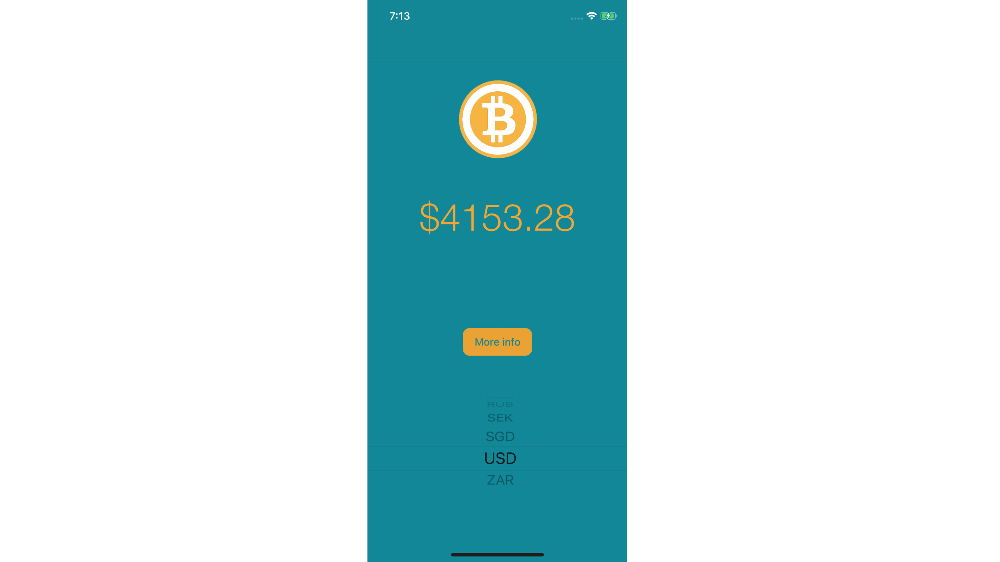

# BitcoinTicker
> Simple bitcoin price tracking app developed in the udemy course ["https://www.udemy.com/ios-12-app-development-bootcamp/"](https://www.udemy.com/ios-12-app-development-bootcamp/) of "Angela Yu"

This is a simple app started from an udemy course which I continued to develop.



## Features added by me:
* Second ViewController with more info
* More in development...

## Meta

Tobias Ruano – [@tobiasruano](https://twitter.com/tobiasruano) – truano@uade.edu.ar

Distributed under the MIT License. See ``LICENSE`` for more information.

[https://github.com/TobiasRuano/BitcoinTicker](https://github.com/TobiasRuano/BitcoinTicker)

## Contributing

1. Fork it (<https://github.com/tobiasruano/BitcoinTicker/fork>)
2. Create your Feature Branch (```git checkout -b feature/AmazingFeature```)
3. Commit your Changes (```git commit -m 'Add some AmazingFeature```)
4. Push to the Branch (```git push origin feature/AmazingFeature```)
5. Create a new Pull Request
